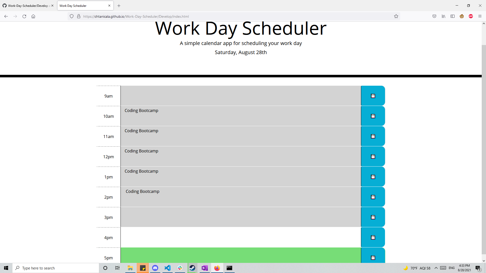

# Work-Day-Scheduler

## Description
- The purpose of this project is to create a visually dynamic work day scheduler that will update the background color of the text area based upon the time of day and the time blocks' comparisons to the current time of day.
- This project focused on the integration of moment.js and jQuery along with Bootstrap as supplemental libaries to HTML, JavaScript, and CSS
- This project also allows for storage of descriptions to the local storage.

## Libaries
- Moment.JS
- Jquery
- Bootstrap

## Screenshot of Application

## URL
- https://github.com/Chtanicala/Work-Day-Scheduler (Repository)
- https://chtanicala.github.io/Work-Day-Scheduler/Develop/index.html (Website)